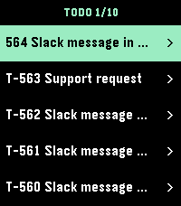
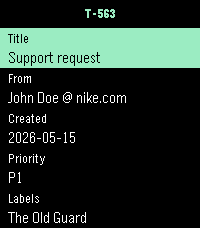
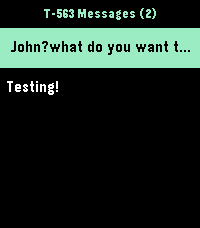

<h2> Pebble Plain</h2>

A Pebble watchapp that shows Plain support threads, details, and recent messages on the watch.

The watch UI is native Pebble C. The phone companion is PebbleKit JS and owns Plain GraphQL requests, Clay configuration, and API-key storage. The watch and phone exchange compact AppMessage strings using record and field separators.

<table>
  <thead>
    <tr>
      <th scope="col">
        Thread List
      </th>
      <th scope="col">
        Thread Details
      </th>
      <th scope="col">
        Thread Messages
      </th>
    </tr>
  </thead>
  <tbody>
    <tr>
      <td>
        
      </td>
      <td>
        
      </td>
      <td>
        
      </td>
    </tr>
  </tbody>
</table>

## Configuration

After installing the application from the [Pebble Store](https://apps.repebble.com/77adb361a9aa4038b0f9cecf), open the app settings in the Pebble/Rebble phone app and enter a Plain machine user API key. The key is stored by PebbleKit JS on the phone and is not sent to the watch.

You can generate a machine user key in Plain under **Settings** → **API** → **Machine users**. The key needs `threads:read` scope to show threads and `messages:read` scope to show recent messages.

### Target platforms

The app targets modern Pebble hardware: **emery** (Pebble Time 2) and **gabbro** (Pebble Round 2). Other platforms are currently not officially supported.

## Development

### Getting started

```sh
pebble build                            # build for all targetPlatforms
pebble install --emulator emery --logs  # install on the emery emulator
pebble install --phone <ip>             # install to a paired phone
```

### Project layout

```
src/c/mdbl.c                   Native watch UI, navigation, AppMessage parsing
src/pkjs/index.js              PebbleKit JS orchestration and payload sending
src/pkjs/plain.js              Plain GraphQL client and response mapping
src/pkjs/settings.js           Phone-side API key storage
src/pkjs/config.js             Clay configuration page
package.json                   Project metadata (UUID, platforms, resources)
wscript                        Build rules — usually no need to edit
```

## License

MIT
